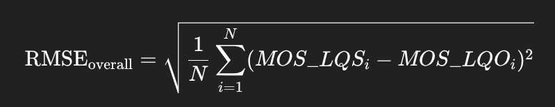
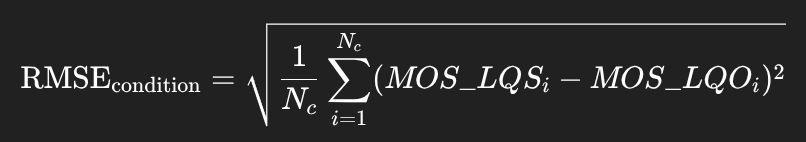

# 环境配置

## 开启容器实例

使用miniconda3镜像。

```bash
docker run -it -v ~/Downloads/TCD-VOIP:/root/TCD_VOIP --name visqol continuumio/miniconda3
```

## 安装Bazel

添加Bazel的GPG key和官方仓库:

```bash
apt-get update && apt install apt-transport-https curl gnupg -y
curl -fsSL https://bazel.build/bazel-release.pub.gpg | gpg --dearmor >bazel-archive-keyring.gpg
mv bazel-archive-keyring.gpg /usr/share/keyrings
echo "deb [arch=amd64 signed-by=/usr/share/keyrings/bazel-archive-keyring.gpg] https://storage.googleapis.com/bazel-apt stable jdk1.8" | tee /etc/apt/sources.list.d/bazel.list
```

安装Bazel:

```bash
apt update && apt install bazel-5.3.2
ln -s /usr/bin/bazel-5.3.2 /usr/bin/bazel
```

## 配置conda环境

```bash
conda create -n visqol
conda activate visqol
pip install numpy pandas openpyxl
```

## 构建ViSQOL

由于网络问题，将`visqol/WORKSPACE`中`armdillo-14.2.3`一项的`url`改为`https://sf-west-interserver-1.dl.sourceforge.net/project/arma/armadillo-14.2.3.tar.xz?viasf=1`。

```bash
git clone https://github.com/google/visqol
cd visqol && bazel build :visqol -c opt
```

# 计算RMSE

## 计算MOS-LQO —— ViSQOL的预测分数

```bash
#!/bin/bash

VISQOL_BIN=./bazel-bin/visqol
TEST_SET_DIR="/root/TCD_VOIP/TestSet"
OUT_DIR="/root/visqol_csv"

mkdir -p $OUT_DIR

# 遍历每个劣化条件文件夹
for condition in chop clip compspkr echo noise; do
    REF_DIR="$TEST_SET_DIR/$condition/ref"
    DEG_DIR="$TEST_SET_DIR/$condition"

    # 创建每个条件对应输出子文件夹
    mkdir -p "$OUT_DIR/$condition"

    for deg_file in "$DEG_DIR"/C_*.wav; do
        base_name=$(basename "$deg_file")
        ref_file="$REF_DIR/R_${base_name:2}"  # C_02_CHOP_FG.wav -> R_02_CHOP_FG.wav
        out_csv="$OUT_DIR/$condition/${base_name%.wav}.csv"

        $VISQOL_BIN --reference_file "$ref_file" --degraded_file "$deg_file" --results_csv "$out_csv"
    done
done
```

- 生成的CSV文件会在`./visqol_csv/`下，每个降质文件一个CSV。
- MOS-LQO位于CSV的第三列。

## 整体RMSE分析



## 分条件RMSE分析



```python
import os
import pandas as pd
import numpy as np

# 1. 配置路径
excel_path = "/root/TCD_VOIP/MOS_LQS.xlsx"   # Excel文件，Sheet 3包含MOS-LQS
csv_root = "./visqol_csv"                    # ViSQOL 输出CSV根目录

# 2. 读取 MOS-LQS（主观评分）
df_mos = pd.read_excel(excel_path, sheet_name=2)  # Sheet 3索引从0开始
df_mos = df_mos[['Filename', 'ConditionID', 'sample MOS']]
df_mos.rename(columns={'sample MOS': 'MOS_LQS'}, inplace=True)
df_mos['Filename'] = df_mos['Filename'].str.strip()
df_mos['MOS_LQS'] = df_mos['MOS_LQS'].astype(float)

# 3. 递归读取 ViSQOL 输出 CSV
moslqo_list = []

for root, dirs, files in os.walk(csv_root):
    for file in files:
        if file.endswith(".csv"):
            path = os.path.join(root, file)
            df_csv = pd.read_csv(path)
            # MOS-LQO 在CSV第三列
            mos_lqo = float(df_csv.iloc[0, 2])
            # 文件名对齐 Excel (CSV C_01_ECHO_FA.csv -> Excel C_01_ECHO_FA.wav)
            filename = file.replace(".csv", ".wav")
            moslqo_list.append((filename, mos_lqo))

df_visqol = pd.DataFrame(moslqo_list, columns=['Filename', 'MOS_LQO'])
df_visqol['Filename'] = df_visqol['Filename'].str.strip()
df_visqol['MOS_LQO'] = df_visqol['MOS_LQO'].astype(float)

# 4. 合并 MOS-LQS 和 MOS-LQO
df = pd.merge(df_mos, df_visqol, on='Filename', how='inner')
print(f"合并后样本数: {len(df)}")
if df.empty:
    raise ValueError("合并后 DataFrame 为空，请检查文件名是否匹配")

# 5. 计算整体 RMSE
rmse_overall = np.sqrt(np.mean((df['MOS_LQS'] - df['MOS_LQO'])**2))
print(f"整体 RMSE: {rmse_overall:.4f}")

# ---------------------------
# 6️⃣ 分条件 RMSE
# ---------------------------
rmse_by_condition = df.groupby('ConditionID')[['MOS_LQS', 'MOS_LQO']].apply(
    lambda x: np.sqrt(np.mean((x['MOS_LQS'] - x['MOS_LQO'])**2))
)
print("\n分条件 RMSE:")
print(rmse_by_condition)

# ---------------------------
# 7️⃣ 可选：保存结果
# ---------------------------
rmse_by_condition.to_csv("rmse_by_condition.csv", header=True)
df.to_csv("merged_mos.csv", index=False)
print("\n结果已保存：rmse_by_condition.csv 和 merged_mos.csv")
```
