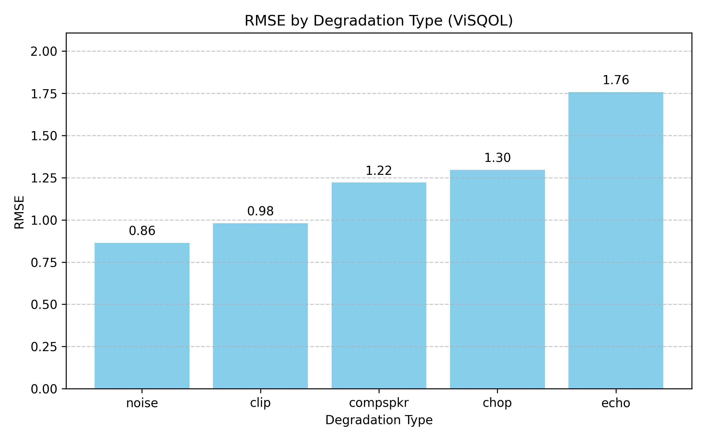

# 环境配置

## 启动容器实例

使用`miniconda3`镜像:

```bash
docker run -it -v ~/Downloads/TCD-VOIP:/root/TCD_VOIP --name visqol continuumio/miniconda3
```

## 安装Bazel

添加Bazel的GPG key和官方仓库:

```bash
apt-get update && apt install apt-transport-https curl gnupg -y
curl -fsSL https://bazel.build/bazel-release.pub.gpg | gpg --dearmor >bazel-archive-keyring.gpg
mv bazel-archive-keyring.gpg /usr/share/keyrings
echo "deb [arch=amd64 signed-by=/usr/share/keyrings/bazel-archive-keyring.gpg] https://storage.googleapis.com/bazel-apt stable jdk1.8" | tee /etc/apt/sources.list.d/bazel.list
```

安装Bazel:

```bash
apt update && apt install bazel-5.3.2
ln -s /usr/bin/bazel-5.3.2 /usr/bin/bazel
```

## 配置conda环境

```bash
conda create -n visqol
conda activate visqol
pip install numpy pandas openpyxl matplotlib
```

## 构建ViSQOL

由于网络问题，将`visqol/WORKSPACE`中`armdillo-14.2.3`一项的`url`改为`https://sf-west-interserver-1.dl.sourceforge.net/project/arma/armadillo-14.2.3.tar.xz?viasf=1`。

然后构建ViSQOL:

```bash
git clone https://github.com/google/visqol
cd visqol && bazel build :visqol -c opt
```

# 计算RMSE

## 计算MOS-LQO —— ViSQOL的预测分数

首先计算ViSQOL的预测分数MOS\_LQO:

```bash
#!/bin/bash

VISQOL_BIN=./bazel-bin/visqol
TEST_SET_DIR="/root/TCD_VOIP/TestSet"
OUT_DIR="/root/visqol_csv"

mkdir -p $OUT_DIR

# 遍历每个劣化条件文件夹
for condition in chop clip compspkr echo noise; do
    REF_DIR="$TEST_SET_DIR/$condition/ref"
    DEG_DIR="$TEST_SET_DIR/$condition"

    # 创建每个条件对应输出子文件夹
    mkdir -p "$OUT_DIR/$condition"

    for deg_file in "$DEG_DIR"/C_*.wav; do
        base_name=$(basename "$deg_file")
        ref_file="$REF_DIR/R_${base_name:2}"  # C_02_CHOP_FG.wav -> R_02_CHOP_FG.wav
        out_csv="$OUT_DIR/$condition/${base_name%.wav}.csv"

        $VISQOL_BIN --reference_file "$ref_file" --degraded_file "$deg_file" --results_csv "$out_csv"
    done
done
```

生成的CSV文件会在`./visqol_csv/`下，每个降质文件一个`.csv`文件。MOS-LQO位于CSV的第三列。

## 计算整体RMSE和分条件RMSE

对所有样本(整体):

$$
\text{RMSE}_{\text{overall}} = \sqrt{\frac{1}{N} \sum_{i=1}^{N} (\text{MOS_LQS}_i - \text{MOS_LQO}_i)^2}
$$

对分条件(chop, clip, compspkr, echo, noise):

$$
\text{RMSE}_{\text{condition}} = \sqrt{\frac{1}{N_c} \sum_{i=1}^{N_c} (\text{MOS_LQS}_i - \text{MOS_LQO}_i)^2}
$$

其中$N$为所有样本数，$N_c$为该条件样本数。

`TCD_VOIP`中包含了每段音频的平均主观评分MOS\_LQS，我们先从`.xlsx`文件中提取出这一数据，再计算RMSE:

```python
import os
import pandas as pd
import numpy as np
import matplotlib.pyplot as plt

# ---------------------------
# 1. 配置路径
# ---------------------------
excel_path = "/root/TCD_VOIP/MOS_LQS.xlsx"   # Excel 文件，Sheet 3
csv_root = "./visqol_csv"                    # ViSQOL 输出 CSV 根目录

# ---------------------------
# 2. 读取 MOS-LQS（主观评分）
# ---------------------------
df_mos = pd.read_excel(excel_path, sheet_name=2)  # Sheet 3
df_mos = df_mos[['Filename', 'ConditionID', 'sample MOS']]
df_mos.rename(columns={'sample MOS': 'MOS_LQS'}, inplace=True)
df_mos['Filename'] = df_mos['Filename'].str.strip()
df_mos['MOS_LQS'] = df_mos['MOS_LQS'].astype(float)

# ---------------------------
# 3. 递归读取 ViSQOL 输出 CSV
# ---------------------------
moslqo_list = []

for root, dirs, files in os.walk(csv_root):
    for file in files:
        if file.endswith(".csv"):
            path = os.path.join(root, file)
            df_csv = pd.read_csv(path)
            # MOS-LQO 在 CSV 第三列
            mos_lqo = float(df_csv.iloc[0, 2])
            # 文件名对齐 Excel (CSV C_01_ECHO_FA.csv -> Excel C_01_ECHO_FA.wav)
            filename = file.replace(".csv", ".wav")
            moslqo_list.append((filename, mos_lqo))

df_visqol = pd.DataFrame(moslqo_list, columns=['Filename', 'MOS_LQO'])
df_visqol['Filename'] = df_visqol['Filename'].str.strip()
df_visqol['MOS_LQO'] = df_visqol['MOS_LQO'].astype(float)

# ---------------------------
# 4. 合并 MOS-LQS 和 MOS-LQO
# ---------------------------
df = pd.merge(df_mos, df_visqol, on='Filename', how='inner')
print(f"合并后样本数: {len(df)}")
if df.empty:
    raise ValueError("合并后 DataFrame 为空，请检查文件名是否匹配")

# ---------------------------
# 5. 提取劣化类型
# ---------------------------
def extract_type(filename):
    fname_upper = filename.upper()
    if 'CHOP' in fname_upper:
        return 'chop'
    elif 'CLIP' in fname_upper:
        return 'clip'
    elif 'COMPSPKR' in fname_upper:
        return 'compspkr'
    elif 'ECHO' in fname_upper:
        return 'echo'
    elif 'NOISE' in fname_upper:
        return 'noise'
    else:
        return 'other'

df['Degradation'] = df['Filename'].apply(extract_type)

# ---------------------------
# 6. 计算整体RMSE
# ---------------------------
rmse_overall = np.sqrt(np.mean((df['MOS_LQS'] - df['MOS_LQO'])**2))
print(f"\n整体 RMSE: {rmse_overall:.4f}")

# ---------------------------
# 7. 按劣化类型分组RMSE
# ---------------------------
rmse_by_type = df.groupby('Degradation')[['MOS_LQS', 'MOS_LQO']].apply(
    lambda x: np.sqrt(np.mean((x['MOS_LQS'] - x['MOS_LQO'])**2))
)
print("\n按劣化类型分组 RMSE:")
print(rmse_by_type)

# ---------------------------
# 8. 保存结果
# ---------------------------
df.to_csv("merged_mos.csv", index=False)
rmse_by_type.to_csv("rmse_by_type.csv", header=True)
print("\n结果已保存：merged_mos.csv 和 rmse_by_type.csv")

# ---------------------------
# 9. 绘制分条件 RMSE 柱状图
# ---------------------------
plt.figure(figsize=(8,5))
rmse_by_type_sorted = rmse_by_type.sort_values()  # 可选：按 RMSE 排序
plt.bar(rmse_by_type_sorted.index, rmse_by_type_sorted.values, color='skyblue')
plt.xlabel("Degradation Type")
plt.ylabel("RMSE")
plt.title("RMSE by Degradation Type (ViSQOL)")
plt.ylim(0, max(rmse_by_type_sorted.values)*1.2)  # 适当留白
plt.grid(axis='y', linestyle='--', alpha=0.7)

# 添加每个柱顶部数值
for i, v in enumerate(rmse_by_type_sorted.values):
    plt.text(i, v + 0.03, f"{v:.2f}", ha='center', va='bottom')

plt.tight_layout()
plt.savefig("rmse_by_type.png", dpi=300)
plt.show()
```

输出为:

```txt
合并后样本数: 384

整体RMSE: 1.2682

按劣化类型分组 RMSE:
Degradation
chop        1.296528
clip        0.980773
compspkr    1.222070
echo        1.757133
noise       0.864563
dtype: float64

结果已保存：merged_mos.csv 和 rmse_by_type.csv
```

所以整体RMSE为`1.2682`，分条件RMSE如下图所示:


